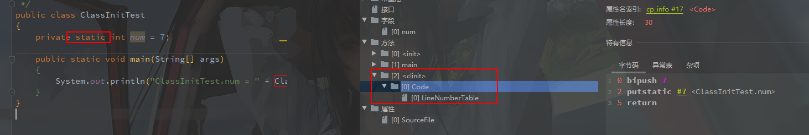

## **1.类加载器子系统作用**


- **类加载器子系统负责从文件系统或者网络中加载Class文件**，class文件在文件开头有特定的文件标识。
- **ClassLoader只负责class文件的加载**，至于它是否可以运行，则由ExecutionEngine(执行引擎)决定。
- **加载的类信息存放于一块称为方法区的内存空间**。除了类的信息外，方法区中还会**存放运行时常量池**信息，可能还包括字符串字面量和数字常量(这部分常量信息是Class文件中常量池部分的内存映射)。

## 2.类加载器ClassLoader角色


- Class file 存在本地硬盘上，可以理解为设计师画在纸上的模板，而最终这个模板在执行的时候要加载到JVM中来，根据这个文件实例化出N个一摸一样的实列。
- Class file 加载到JVM中，被称为DNA元数据模板，放在方法区
- **在.class文件-》JVM-》最终成为元数据模板，此过程需要一个运输工具（类加载子系统）扮演一个快递员的角色**

## 3.类的加载过程

### 3.1代码

```java
public class HelloLoader {
    public static void main(String[] args) {
        System.out.println("谢谢ClassLoader加载我....");
        System.out.println("你的大恩大德，我下辈子再报！");
    }
}
```

### 3.2它的加载过程是怎么样的呢?


### 3.3类加载整体过程


#### 3.3.1类加载过程一: Loading(加载阶段)

1. **通过一个类的全限定名获取定义此类的二进制字节流**
2. 将这个字节流所代表的静态存储结构转化为**方法区的运行时数据结构**
3. **在内存中生成一个代表这个类的java.lang.Class对象**，作为方法区这个类的各种数据的访问入口


#### 3.3.2类加载过程二: Linking(链接阶段)

> **链接分为三个子阶段：验证 --> 准备 --> 解析**

##### ==**验证(Verify)**==

- **目的在于确保Class文件的字节流中包含信息符合当前虚拟机要求，保证被加载类的正确性，不会危害虚拟机自身安全**
  - 使用 BinaryViewer 查看字节码文件，其开头均为 *CAFE BABE* ，如果出现不合法的字节码文件，那么将会验证不通过
- 主要包括四种验证，文件格式验证，元数据验证，字节码验证，符号引用验证。

##### ==**准备**(Prepare)==

- **为类变量分配内存并且设置该类变量的默认初始值，即零值**
- 这里==不包含用final修饰==的static，因为final在编译的时候就会分配好了默认值，准备阶段会显式初始化
- 注意：**这里不会为实例变量分配初始化，类变量会分配在方法区中，而实例变量是会随着对象一起分配到Java堆中**

```java
public class HelloApp {
    // 变量a在准备阶段会赋初始值，但不是1，而是0，在初始化阶段会被赋值为 1
    private static int a = 1;   //prepare：a = 0 ---> initial : a = 1

    public static void main(String[] args) {
        System.out.println(a);
    }
}
```

##### ==**解析(Resolve)**==

- **将常量池内的符号引用转换为直接引用的过程**
- 事实上，解析操作往往会伴随着JVM在执行完初始化之后再执行
- 符号引用就是一组符号来描述所引用的目标。符号引用的字面量形式明确定义在《java虚拟机规范》的class文件格式中。直接引用就是直接指向目标的指针、相对偏移量或一个间接定位到目标的句柄
- 解析动作主要针对类或接口、字段、类方法、接口方法、方法类型等。对应常量池中的CONSTANT Class info、CONSTANT Fieldref info、CONSTANT Methodref info等

#### 3.3.3类加载过程三: Initialization(初始化阶段)

- **初始化阶段就是执行类构造器方法`<clinit>()`的过程** 

- 此方法不需定义，是javac编译器自动收集类中的所有类变量的赋值动作和静态代码块中的语句合并而来。也就是说，**当我们代码中包含==static变量==的时候，就会有clinit方法 没有static变量的时候 就没有clinit**

  

- **`<clinit>()`方法中的指令按语句在源文件中出现的顺序执行**

     


- `<clinit>()`不同于类的构造器。（关联：构造器是虚拟机视角下的`<init>()`）


- **若该类具有父类，JVM会保证子类的`<clinit>()`执行前，父类的`<clinit>()`已经执行完毕**

```java
public class ClinitTest1 {
    static class Father{
        public static int A = 1;
        static{
            A = 2;
        }
    }
    static class Son extends Father{
        public static int B = A;
    }
    public static void main(String[] args) {
        //加载Father类，其次加载Son类。
        System.out.println(Son.B);//2
    }
}
```

- **虚拟机必须保证一个类的`<clinit>()`方法在多线程下被同步加锁**

```java
public class DeadThreadTest {
    public static void main(String[] args) {
        Runnable r = () -> {
            System.out.println(Thread.currentThread().getName() + "开始");
            DeadThread dead = new DeadThread();
            System.out.println(Thread.currentThread().getName() + "结束");
        };

        Thread t1 = new Thread(r, "线程1");
        Thread t2 = new Thread(r, "线程2");

        t1.start();
        t2.start();
    }
}
class DeadThread {
    static {
        if (true) {
            System.out.println(Thread.currentThread().getName() + "初始化当前类");
            while (true) {

            }
        }
    }
}
```

## 4.类加载器的分类

1. **JVM支持两种类型的类加载器 。分别为引导类加载器（Bootstrap ClassLoader）和自定义类加载器（User-Defined ClassLoader）**
2. 从概念上来讲，自定义类加载器一般指的是程序中由开发人员自定义的一类类加载器，但是Java虚拟机规范却没有这么定义，而是**将所有派生于抽象类ClassLoader的类加载器都划分为自定义类加载器**
3. 无论类加载器的类型如何划分，在程序中我们最常见的类加载器始终只有3个
4. 这里的四者之间是包含关系，不是上层和下层，也不是子父类的继承关系。


```java
public class ClassLoaderTest {
    public static void main(String[] args) {

        //获取系统类加载器
        ClassLoader systemClassLoader = ClassLoader.getSystemClassLoader();
        System.out.println(systemClassLoader);//sun.misc.Launcher$AppClassLoader@18b4aac2

        //获取其上层：扩展类加载器
        ClassLoader extClassLoader = systemClassLoader.getParent();
        System.out.println(extClassLoader);//sun.misc.Launcher$ExtClassLoader@1540e19d

        //获取其上层：获取不到引导类加载器
        ClassLoader bootstrapClassLoader = extClassLoader.getParent();
        System.out.println(bootstrapClassLoader);//null

        //对于用户自定义类来说：默认使用系统类加载器进行加载
        ClassLoader classLoader = ClassLoaderTest.class.getClassLoader();
        System.out.println(classLoader);//sun.misc.Launcher$AppClassLoader@18b4aac2

        //String类使用引导类加载器进行加载的。---> Java的核心类库都是使用引导类加载器进行加载的。
        ClassLoader classLoader1 = String.class.getClassLoader();
        System.out.println(classLoader1);//null

    }
}
```

> - 我们尝试获取引导类加载器，获取到的值为 null ，这并不代表引导类加载器不存在，**因为引导类加载器右 C/C++ 语言，我们获取不到**
> - 两次获取系统类加载器的值都相同：sun.misc.Launcher$AppClassLoader@18b4aac2 ，这说明**系统类加载器是全局唯一的**

### 4.1引导类加载器（**Bootstrap ClassLoader**）

1. **这个类加载使用C/C++语言实现的，嵌套在JVM内部**
2. **它用来`加载Java的核心库`（JAVA_HOME/jre/lib/rt.jar、resources.jar或sun.boot.class.path路径下的内容），用于提供JVM自身需要的类**
3. **并不继承自java.lang.ClassLoader，没有父加载器**
4. **加载 `扩展类`和`应用程序类`加载器，并作为他们的父类加载器（当他俩的爹）**
5. **出于安全考虑，Bootstrap启动类加载器只加载包名为java、javax、sun等开头的类**

### 4.2扩展类加载器（**Extension ClassLoader**）

1. **Java语言编写，由sun.misc.Launcher$ExtClassLoader实现**
2. **派生于ClassLoader类**
3. **父类加载器为引导类加载器**
4. **从java.ext.dirs系统属性所指定的目录中加载类库，或从JDK的安装目录的jre/lib/ext子目录（扩展目录）下加载类库。如果用户创建的JAR放在此目录下，也会自动由扩展类加载器加载**

### 4.3系统类加载器（**AppClassLoader**）

1. **Java语言编写，由sun.misc.LaunchersAppClassLoader实现**
2. **派生于ClassLoader类**
3. **父类加载器为扩展类加载器**
4. **它负责加载环境变量classpath或系统属性java.class.path指定路径下的类库**
5. **该类加载是程序中默认的类加载器，一般来说，Java应用的类都是由它来完成加载**
6. **通过classLoader.getSystemclassLoader()方法可以获取到该类加载器**